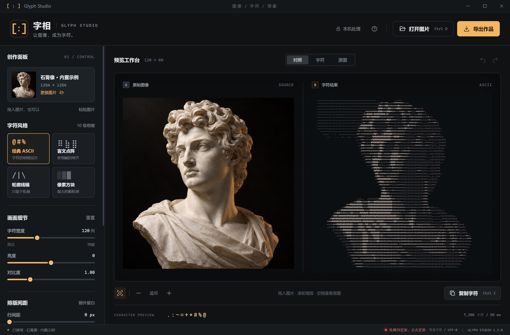

# 字相 · Glyph Studio

面向 Windows 10/11 x64 的本地图像转字符画工作台。图片解码、转换和导出均在本机完成；1.3.0 起程序每次启动会向 `api.github.com` 查询最新稳定版本元数据，确认更新后才会从 GitHub 官方资产下载对应的 Windows x64 便携版，不上传图片、不需要账号。


## 功能

- 四种转换模式：经典 ASCII、盲文点阵、轮廓线稿、像素方块。
- 五种导出格式：TXT、PNG、SVG、HTML、ANSI。
- 支持拖放、原生打开图片和剪贴板粘贴；结果实时预览。
- 可调整字符宽度、亮度、对比度、Gamma、阈值、自动增强、抖动、反转、配色和排版间距，并自动补正画面比例。
- 转换参数保存在本机；导入图片和生成的字符结果不会写入历史文件。

## 使用便携版

从 [GitHub Releases 下载最新版](https://github.com/BerryFuwawa/glyph-studio/releases/latest)，选择 `.exe` 文件即可运行；同页面提供 `.sha256` 校验文件。

当前版本的构建文件名为 `Glyph-Studio-1.3.0-Windows-x64.exe`。下载后将它放到有写入权限的文件夹并双击运行。便携版不需要安装 Node.js、Python 或其他运行时，也不要求管理员权限；首次启动可能需要几秒钟解压内置运行时到临时目录。

这是未签名的 Windows 便携程序，Windows Defender SmartScreen 可能显示发布者未知。先确认文件来源和文件哈希（如果维护者同时提供哈希），再在你信任该文件时选择“更多信息”→“仍要运行”。不要为了启动程序而全局关闭 Defender、SmartScreen 或其他系统安全策略；组织策略阻止执行时，请联系管理员或从源码构建。

图片处理和导出期间不会发送网络请求。便携版启动时会访问 `api.github.com` 获取最新稳定版本元数据；只有你确认“更新并重启”后，程序才会从 GitHub Release 或 `release-assets.githubusercontent.com` 下载官方 Windows x64 资产。更新下载会显示进度，并在替换前校验发布的 SHA-256 和文件大小；不会上传图片、账号或其他应用数据。源码开发和非 Windows/非便携运行时只能检测更新并打开官方下载页面，不会替换或删除源码、Electron 运行时或其他文件。源码依赖安装和 Electron 运行时准备可能需要网络，见[源码开发](#源码开发)。

## 检查与安装更新

1.3.0 及之后的 Windows x64 便携版每次启动会自动检查最新稳定版本。右下角会显示“自动检查更新…”，检查完成后显示“已是最新版”或“检查失败点击重试”；离线或请求失败时可以点击状态重试。发现新版本时，右下角会出现红点并显示“检测到更新，点击更新”。



点击更新后，程序会先确认“更新并重启”，并提醒先导出当前作品。确认后，程序把对应的官方 Windows x64 Release EXE 下载到当前便携版所在目录，显示进度并提供取消下载按钮，然后校验 SHA-256 和文件大小。取消下载、目录只读、下载不完整、缺少摘要、网络中断或替换失败时会显示中文错误，保留旧版本或恢复备份，不需要管理员权限。替换过程由隐藏的 Windows 更新助手等待旧程序退出和文件解锁，再保留备份、替换为官方版本文件名并重启；只有新程序完成启动握手后才删除备份。

更新会保留同一 `userData` 中的参数设置；当前导入的图片和字符结果只在本次运行内存中，重启后不会恢复，请在确认更新前导出。1.2.0 首次升级到 1.3.0 时，旧版仍需按 `F1` 手动检查更新并在浏览器中下载，因为旧版没有内置替换逻辑；完成一次手动升级后，1.3.0 及之后版本支持上述流程。

## 快速开始

1. 把图片拖入窗口，或点击“打开图片”、按 `Ctrl+V` 粘贴剪贴板图片。
2. 选择一种模式并调整参数。预览可切换“对照”“字符”“原图”，滚轮或工具栏可缩放；“排版间距”中的“自动补正画面比例”默认开启。
3. 点击“复制字符”复制带换行的字符字符串，或点击“导出作品”保存文件。

支持 PNG、JPG/JPEG、WebP、BMP、GIF 和 AVIF。单个文件最大 50 MB，原图最多 4,000 万像素且最长边不超过 20,000 像素；动图只转换第一帧。为保持交互速度，大图会在本机缩小到最长边 1,600 像素后参与转换，界面仍显示原始宽高。

### 四种模式

| 模式 | 适合场景 | 说明 |
| --- | --- | --- |
| 经典 ASCII | 通用明暗字符画 | 默认使用 ` .:-=+*#%@`，可编辑单格字符序列 |
| 盲文点阵 | 保留细节 | 每个字符表示 2×4 点，需要支持 Unicode Braille 的字体 |
| 轮廓线稿 | 结构和边缘 | 使用方向边缘字符 `/`、`\\`、`\|`、`-` |
| 像素方块 | 颗粒感和海报效果 | 使用空格、`░▒▓█` 五级方块 |

字符宽度界面范围为 40–280 列；极端长宽比的图片会按输出行数和总字符数上限自动缩小。ASCII 模式显示字符序列输入框；盲文和轮廓模式显示阈值；轮廓和方块模式不使用抖动补偿。

“排版间距”侧栏可以增加字符行之间的行间距（0–24 px）和相邻字符之间的字符间距（0–12 px），两项默认均为 0。“自动补正画面比例”默认开启：行间距和字符间距会参与物理字符网格测量，程序会按接近原图比例的方式重算行数。行间距越大，行数通常越少；字符间距越大，行数通常越多；600 行或 180,000 个字符格的限制也可能使实际列数减少。关闭该选项会固定转换网格，让间距像 1.1.1 一样只拉伸画布。画布预览以及 PNG、SVG、HTML 导出会保留物理间距；复制出的字符字符串、TXT 和 ANSI 无法编码像素间距，但自动补正导致的字符网格变化会反映在其中。

### 导出格式

| 格式 | 内容 | 适合用途 |
| --- | --- | --- |
| TXT | UTF-8 纯文本、当前字符网格的列宽和换行，无颜色或像素间距 | 粘贴、编辑、文字素材 |
| PNG | 当前预览的字符画图片、配色和排版间距 | 分享、文档插图 |
| SVG | 矢量文字、配色和排版间距 | 缩放、排版 |
| HTML | 可离线打开的独立网页，含字符、颜色和排版间距 | 浏览器展示 |
| ANSI | UTF-8 文本与真彩色控制码，不包含像素间距 | 支持 ANSI 真彩色的终端 |

TXT 和 ANSI 建议使用 Cascadia Mono 或 Consolas 等宽字体。SVG/HTML 在不同设备上可能使用不同字体，字形会略有差异；需要保留当前预览外观时请选择 PNG。保存时由 Windows 原生对话框选择目标位置；如果手动输入的扩展名与格式不一致，程序会补上实际格式扩展名。

## 快捷键

| 操作 | 快捷键 |
| --- | --- |
| 打开图片 | `Ctrl+O` |
| 粘贴图片 | `Ctrl+V` |
| 复制字符 | `Ctrl+C` |
| 导出作品 | `Ctrl+S` |
| 撤销 / 重做参数 | `Ctrl+Z` / `Ctrl+Y` |
| 适应窗口 | `Ctrl+0` |
| 缩放预览 | 滚轮、`Ctrl+`、`Ctrl-` |
| 临时查看原图 | 在画布区域按住空格 |
| 打开帮助 | `F1` |

## 源码开发

源码构建需要 Node.js `>=24` 和 npm；Node.js 24 已用于本项目验证。Electron 版本固定为 `44.5.1`。在仓库目录执行：

```powershell
npm ci
npm start
npm test
npm run build
```

`npm ci` 安装锁定的开发依赖。Electron 的可执行运行时可能在第一次 `npm start` 或 `npm run build` 时才完成下载或准备，因此依赖安装命令成功不等于 Electron 已经可以启动。`npm ci --ignore-scripts` 适合做不执行安装脚本的依赖审计或测试准备；随后仍需让 Electron 运行时按正常流程完成准备。源码开发阶段可能需要网络。源码运行和非 Windows/非便携运行时可以读取版本元数据并前往官方 Release 下载，但不会执行便携版自替换；打包后的 Windows x64 便携版运行阶段仅在启动检查或你确认更新下载时联网。

常用验证命令：

```powershell
npm test
npx electron . --qa
node scripts/qa-desktop.cjs
node scripts/qa-browser.cjs
```

`scripts/qa-browser.cjs` 使用本机 Chrome；若自动发现失败，可在 PowerShell 中设置 `CHROME_PATH` 后再运行。验证结果和截图写入被忽略的 `qa-results/` 目录。`npm run build` 生成 Windows x64 portable 目标；当前版本产物为 `dist/Glyph-Studio-1.3.0-Windows-x64.exe`。需要验证解包后的应用时，先确保存在 `dist/win-unpacked/Glyph Studio.exe`，再运行 `node scripts/qa-packaged.cjs`。源码运行的更新流程只用于检查和打开下载页面，不会替换开发目录。

代码结构、测试分层和安全边界见[架构说明](docs/architecture.md)与[开发指南](docs/development.md)。

## 仓库布局

```text
src/                  Electron 应用源码、转换核心和内置素材（src/assets/）
tests/                Node.js 单元测试
scripts/              QA 检查与图标生成脚本
docs/                 用户、架构、发布和许可文档
.github/              工作流、贡献指南和安全政策
package.json          依赖与构建配置
```

## 文档

- [用户指南](docs/user-guide.md)：从导入到导出的完整操作说明。
- [架构说明](docs/architecture.md)：数据流、模块边界和本地处理与网络边界设计。
- [开发指南](docs/development.md)：安装、测试、调试和打包。
- [常见问题](docs/faq.md)：字体、限制、SmartScreen 和联网边界。
- [1.3.0 发布说明](docs/release-1.3.0.md)：启动检查、校验后自更新、迁移提示和网络边界。
- [1.2.0 发布说明](docs/release-1.2.0.md)：自动补正画面比例、排版间距和下载文件。
- [发布流程](docs/releasing.md)：维护者可选的检查与 GitHub CLI 流程。
- [1.1.1 发布说明](docs/release-1.1.1.md)：上一版本的手动检查更新、下载入口和网络边界。
- [1.1.0 发布说明](docs/release-1.1.0.md)：本版本亮点、下载文件和已知限制。
- [贡献指南](.github/CONTRIBUTING.md)
- [安全政策](.github/SECURITY.md)
- [更新日志](docs/CHANGELOG.md)

## 开源与素材

源码采用 MIT 许可证，见 [LICENSE](LICENSE)。开源项目只用于算法和交互思路参考，转换与界面代码为独立实现，详见 [REFERENCES.md](docs/REFERENCES.md)。Electron 及其依赖附带各自的许可声明。

内置示例 `src/assets/sculpture.png` 由内置 imagegen 工具生成。生成提示词：白色大理石古典雕塑胸像，略向左转的脸、卷发、象牙色左上方光源与细微琥珀边缘光，近黑背景，清晰轮廓与平滑明暗过渡，无文字、无标志、无界面。第三方许可、运行时许可证和素材说明见 [THIRD_PARTY_NOTICES.md](docs/THIRD_PARTY_NOTICES.md)。
