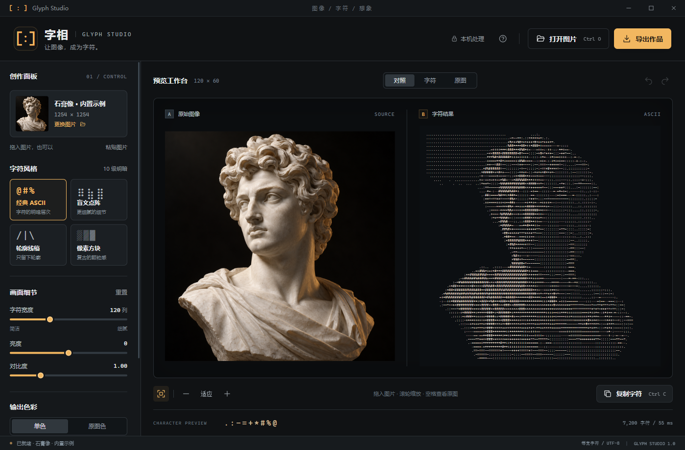

# 字相 · Glyph Studio

离线图像转字符画工作台，面向 Windows 10/11 x64。程序在本机完成解码、转换和导出，不需要账号、云服务或网络连接。



## 功能

- 四种转换模式：经典 ASCII、盲文点阵、轮廓线稿、像素方块。
- 五种导出格式：TXT、PNG、SVG、HTML、ANSI。
- 支持拖放、原生打开图片和剪贴板粘贴；结果实时预览。
- 可调整字符宽度、亮度、对比度、Gamma、阈值、自动增强、抖动、反转和配色。
- 转换参数保存在本机；导入图片和生成的字符结果不会写入历史文件。

## 使用便携版

从 [GitHub Releases 下载最新版](https://github.com/BerryFuwawa/glyph-studio/releases/latest)，选择 `.exe` 文件即可运行；同页面提供 `.sha256` 校验文件。

当前版本的构建文件名为 `Glyph-Studio-1.0.0-Windows-x64.exe`。源码仓库是 [BerryFuwawa/glyph-studio](https://github.com/BerryFuwawa/glyph-studio)，如果维护者已上传构建文件，可从 [Releases](https://github.com/BerryFuwawa/glyph-studio/releases) 获取；请以页面实际状态为准。从可信来源取得文件后，将它放到有写入权限的文件夹并双击运行。便携版不需要安装 Node.js、Python 或其他运行时，也不要求管理员权限；首次启动可能需要几秒钟解压内置运行时到临时目录。

这是未签名的 Windows 便携程序，Windows Defender SmartScreen 可能显示发布者未知。先确认文件来源和文件哈希（如果维护者同时提供哈希），再在你信任该文件时选择“更多信息”→“仍要运行”。不要为了启动程序而全局关闭 Defender、SmartScreen 或其他系统安全策略；组织策略阻止执行时，请联系管理员或从源码构建。

程序运行期间不请求网络。源码依赖安装和 Electron 运行时准备可能需要网络，见[源码开发](#源码开发)。

## 快速开始

1. 把图片拖入窗口，或点击“打开图片”、按 `Ctrl+V` 粘贴剪贴板图片。
2. 选择一种模式并调整参数。预览可切换“对照”“字符”“原图”，滚轮或工具栏可缩放。
3. 点击“复制字符”复制带换行的字符字符串，或点击“导出作品”保存文件。

支持 PNG、JPG/JPEG、WebP、BMP、GIF 和 AVIF。单个文件最大 50 MB，原图最多 4,000 万像素且最长边不超过 20,000 像素；动图只转换第一帧。为保持交互速度，大图会在本机缩小到最长边 1,600 像素后参与转换，界面仍显示原始宽高。

### 四种模式

| 模式 | 适合场景 | 说明 |
| --- | --- | --- |
| 经典 ASCII | 通用明暗字符画 | 默认使用 ` .:-=+*#%@`，可编辑单格字符序列 |
| 盲文点阵 | 保留细节 | 每个字符表示 2×4 点，需要支持 Unicode Braille 的字体 |
| 轮廓线稿 | 结构和边缘 | 使用方向边缘字符 `/`、`\\`、`\|`、`-` |
| 像素方块 | 颗粒感和海报效果 | 使用空格、`░▒▓█` 五级方块 |

字符宽度界面范围为 40–280 列；极端长宽比的图片会按输出行数和总字符数上限自动缩小。ASCII 模式显示字符序列输入框；盲文和轮廓模式显示阈值；轮廓和方块模式不使用抖动补偿。

### 导出格式

| 格式 | 内容 | 适合用途 |
| --- | --- | --- |
| TXT | UTF-8 纯文本、固定列宽和换行，无颜色 | 粘贴、编辑、文字素材 |
| PNG | 当前预览的字符画图片和配色 | 分享、文档插图 |
| SVG | 矢量文字和配色 | 缩放、排版 |
| HTML | 可离线打开的独立网页，含字符和颜色 | 浏览器展示 |
| ANSI | UTF-8 文本与真彩色控制码 | 支持 ANSI 真彩色的终端 |

TXT 和 ANSI 建议使用 Cascadia Mono 或 Consolas 等宽字体。SVG/HTML 在不同设备上可能使用不同字体，字形会略有差异；需要保留当前预览外观时请选择 PNG。保存时由 Windows 原生对话框选择目标位置；如果手动输入的扩展名与格式不一致，程序会补上实际格式扩展名。

## 快捷键

| 操作 | 快捷键 |
| --- | --- |
| 打开图片 | `Ctrl+O` |
| 粘贴图片 | `Ctrl+V` |
| 复制字符 | `Ctrl+C` |
| 导出作品 | `Ctrl+S` |
| 撤销 / 重做参数 | `Ctrl+Z` / `Ctrl+Y` |
| 适应窗口 | `Ctrl+0` |
| 缩放预览 | 滚轮、`Ctrl+`、`Ctrl-` |
| 临时查看原图 | 在画布区域按住空格 |
| 打开帮助 | `F1` |

## 源码开发

源码构建需要 Node.js `>=24` 和 npm；Node.js 24 已用于本项目验证。Electron 版本固定为 `44.5.1`。在仓库目录执行：

```powershell
npm ci
npm start
npm test
npm run build
```

`npm ci` 安装锁定的开发依赖。Electron 的可执行运行时可能在第一次 `npm start` 或 `npm run build` 时才完成下载或准备，因此依赖安装命令成功不等于 Electron 已经可以启动。`npm ci --ignore-scripts` 适合做不执行安装脚本的依赖审计或测试准备；随后仍需让 Electron 运行时按正常流程完成准备。源码开发阶段可能需要网络，打包后的便携版运行阶段不需要网络。

常用验证命令：

```powershell
npm test
npx electron . --qa
node qa-desktop.cjs
node qa-browser.cjs
```

`qa-browser.cjs` 使用本机 Chrome；若自动发现失败，可在 PowerShell 中设置 `CHROME_PATH` 后再运行。验证结果和截图写入被忽略的 `qa-results/` 目录。`npm run build` 生成 Windows x64 portable 目标；当前版本产物为 `dist/Glyph-Studio-1.0.0-Windows-x64.exe`。需要验证解包后的应用时，先确保存在 `dist/win-unpacked/Glyph Studio.exe`，再运行 `node qa-packaged.cjs`。

代码结构、测试分层和安全边界见[架构说明](docs/architecture.md)与[开发指南](docs/development.md)。

## 文档

- [用户指南](docs/user-guide.md)：从导入到导出的完整操作说明。
- [架构说明](docs/architecture.md)：数据流、模块边界和离线安全设计。
- [开发指南](docs/development.md)：安装、测试、调试和打包。
- [常见问题](docs/faq.md)：字体、限制、SmartScreen 和离线行为。
- [发布流程](docs/releasing.md)：维护者可选的检查与 GitHub CLI 流程。
- [贡献指南](CONTRIBUTING.md)
- [安全政策](SECURITY.md)
- [更新日志](CHANGELOG.md)

## 开源与素材

源码采用 MIT 许可证，见 [LICENSE](LICENSE)。开源项目只用于算法和交互思路参考，转换与界面代码为独立实现，详见 [REFERENCES.md](REFERENCES.md)。Electron 及其依赖附带各自的许可声明。

内置示例 `assets/sculpture.png` 由内置 imagegen 工具生成。生成提示词：白色大理石古典雕塑胸像，略向左转的脸、卷发、象牙色左上方光源与细微琥珀边缘光，近黑背景，清晰轮廓与平滑明暗过渡，无文字、无标志、无界面。第三方许可、运行时许可证和素材说明见 [THIRD_PARTY_NOTICES.md](THIRD_PARTY_NOTICES.md)。
