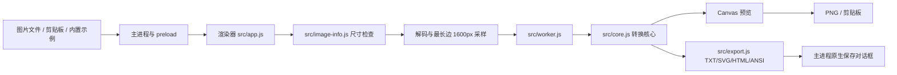

# 架构说明

Glyph Studio 是一个只包含本地资源的 Electron 桌面应用，应用文件集中在 `src/`。主进程负责窗口和原生能力，渲染器负责界面与预览，转换核心在 Web Worker 中运行。

## 模块职责

| 文件 | 职责 |
| --- | --- |
| `src/main.cjs` | 创建窗口、注册 `glyph://` 本地协议、打开/保存文件、读写剪贴板、处理窗口控制 IPC |
| `src/preload.cjs` | 以最小白名单把打开、粘贴、复制、保存和窗口操作暴露给渲染器 |
| `src/index.html` / `src/styles.css` | 界面结构、控件、响应式布局和对话框 |
| `src/app.js` | 参数状态、历史、导入、预览、快捷键、Worker 调度和导出编排 |
| `src/image-info.js` | 在图像解码前读取 PNG、GIF、JPEG、BMP、WebP、AVIF 尺寸，降低超大图像带来的风险 |
| `src/worker.js` | 接收像素和参数，在后台调用转换核心并回传结果 |
| `src/core.js` | 无依赖的亮度映射、面积采样、Gamma/对比度、抖动、Braille 点位和 Sobel 方向边缘算法 |
| `src/export.js` | 配色、HTML/SVG 转义和 SVG、HTML、ANSI 格式化 |
| `src/assets/` | 内置图标和示例图片 |

## 转换流程

1. 主进程通过原生文件对话框读取允许的图片格式，或从剪贴板读取图片；渲染器也接受拖放文件。
2. `src/image-info.js` 检查可识别的尺寸。文件大小上限是 50 MB，原图最多 4,000 万像素，任一边不超过 20,000 像素。
3. 浏览器解码图片并绘制到本地 Canvas；最长边超过 1,600 像素时先缩小。动图的当前实现使用第一帧。
4. `src/app.js` 把像素和参数发送给 Worker。`src/core.js` 进行 Rec.709 加权、透明度背景合成、面积采样、明暗校正和对应模式的字符映射。
5. 输出网格限制为最多 600 行、180,000 个字符格；极端比例会自动降低实际列数。结果返回到渲染器后绘制 Canvas，并传给导出格式化器。

## IPC 和本地资源

主进程只向 `glyph://app/` 白名单资源提供 `src/index.html`、脚本、样式和 `src/assets/` 内置素材。渲染器不直接访问 Node.js API；文件打开、剪贴板和保存均通过 `src/preload.cjs` 暴露的窄接口完成。IPC 处理器会验证请求来自当前窗口和指定本地页面，并限制输入格式、大小和导出内容长度。

导出路径由用户在原生保存对话框中选择，应用不会自行扫描或上传目录。转换参数使用浏览器本地存储；图片像素和结果对象只在当前进程内存中流转。

## 安全边界

- BrowserWindow 开启 `sandbox` 和 `contextIsolation`，关闭 `nodeIntegration`。
- 禁止新窗口和页面导航；权限请求统一拒绝。
- 主窗口会话的普通 HTTP、HTTPS、WebSocket 请求在会话层取消，应用资源通过受限的本地协议提供；帮助中的“检查更新”是用户主动触发的联网例外，只向 `api.github.com` 读取版本元数据。
- 版本检查不发送图片或账号信息，不在应用启动时运行，也不自动下载或安装更新；发现新版本后由用户点击“前往下载”在默认浏览器打开官方 GitHub Release 页面。
- HTML 导出会转义字符和标题，并使用 `default-src 'none'` 的内容安全策略；导出文件仍应按普通用户文件管理。
- 便携版构建未签名，Windows 可能提示 SmartScreen。文档不会建议全局关闭系统安全功能；使用者应核对来源或哈希后再决定是否运行。

## 设计取舍

转换核心保持无依赖，便于 Node 内置测试器和 Web Worker 复用。Electron 只承担桌面集成和文件能力，UI 与算法之间通过消息传递解耦。当前实现不包含视频转换、动画导出、字符形状匹配或多图批处理；这些不属于 1.0.0 的既定范围。
